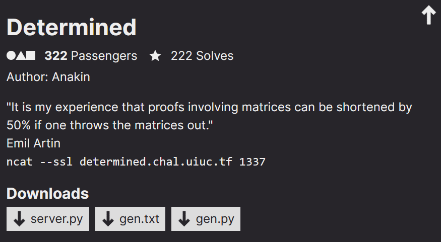
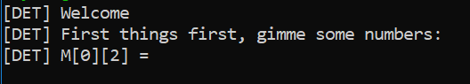

<link rel="stylesheet" href="../writeupcss.css">
<link rel="stylesheet" href="../code.css">

<h2>
{{ site.subtitle }}
</h2>

[Home](https://stainedswan.github.io/UIUCTF-2024)
[OSINT](https://stainedswan.github.io/UIUCTF-2024/OSINT)
[Crypto](https://stainedswan.github.io/UIUCTF-2024/Crypto)
[Miscellaneous](https://stainedswan.github.io/UIUCTF-2024/Miscellaneous)

# Determined Writeup

<div style="text-align:center" markdown="1">
<h2>

Description
</h2>
</div>

<div style="text-align:center"></div>

## Information gained from prompt
- server.py file
- gen.txt
- gen.py file

### server.py file contents
```python
from Crypto.Util.number import bytes_to_long, long_to_bytes
from itertools import permutations
from SECRET import FLAG, p, q, r


def inputs():
    print("[DET] First things first, gimme some numbers:")
    M = [
        [0, 0, 0, 0, 0],
        [0, 0, 0, 0, 0],
        [0, 0, 0, 0, 0],
        [0, 0, 0, 0, 0],
        [0, 0, 0, 0, 0],
    ]
    try:
        M[0][0] = p
        M[0][2] = int(input("[DET] M[0][2] = "))
        M[0][4] = int(input("[DET] M[0][4] = "))

        M[1][1] = int(input("[DET] M[1][1] = "))
        M[1][3] = int(input("[DET] M[1][3] = "))

        M[2][0] = int(input("[DET] M[2][0] = "))
        M[2][2] = int(input("[DET] M[2][2] = "))
        M[2][4] = int(input("[DET] M[2][4] = "))

        M[3][1] = q
        M[3][3] = r

        M[4][0] = int(input("[DET] M[4][0] = "))
        M[4][2] = int(input("[DET] M[4][2] = "))
    except:
        return None
    return M

def handler(signum, frame):
    raise Exception("[DET] You're trying too hard, try something simpler")

def fun(M):
    def sign(sigma):
        l = 0
        for i in range(5):
            for j in range(i + 1, 5):
                if sigma[i] > sigma[j]:
                    l += 1
        return (-1)**l

    res = 0
    for sigma in permutations([0,1,2,3,4]):
        curr = 1
        for i in range(5):
            curr *= M[sigma[i]][i]
        res += sign(sigma) * curr
    return res

def main():
    print("[DET] Welcome")
    M = inputs()
    if M is None:
        print("[DET] You tried something weird...")
        return

    res = fun(M)
    print(f"[DET] Have fun: {res}")

if __name__ == "__main__":
    main()
```
#### Running server.py


### gen.txt contents
```txt
n = 158794636700752922781275926476194117856757725604680390949164778150869764326023702391967976086363365534718230514141547968577753309521188288428236024251993839560087229636799779157903650823700424848036276986652311165197569877428810358366358203174595667453056843209344115949077094799081260298678936223331932826351
e = 65535
c = 72186625991702159773441286864850566837138114624570350089877959520356759693054091827950124758916323653021925443200239303328819702117245200182521971965172749321771266746783797202515535351816124885833031875091162736190721470393029924557370228547165074694258453101355875242872797209141366404264775972151904835111
```

### gen.py file contents
```python
from SECRET import FLAG, p, q, r
from Crypto.Util.number import bytes_to_long
n = p * q
e = 65535
m = bytes_to_long(FLAG)
c = pow(m, e, n)
# printed to gen.txt
print(f"{n = }")
print(f"{e = }")
print(f"{c = }")
```

## Information Gathering Stage
Looking at gen.txt, we realized that this challenge involved `RSA encryption`. Then, looking at server.py, we realized that we would somehow have to get the values for p and q out of the M matrix. Unlike the Without a Trace challenge, the sign() function would come into play as it was a factor in the return value. The return value would be a summation, and a good chunk of the operands would be 0 due to all of the 0’s in the matrix, so we wrote a sample script where the non zero values in the matrix would be 1 and figured out which permutations of the matrix would be non zero and what the corresponding signs would be. 

## Thinking Stage
Once we had that, we figured that the way to solve this challenge would be to input a series of values that could result in the script outputting p or q. We figured out that the input sequence 100101110 would result in an output of -q. 

## The Solve
Given this, finding q was trivial. We then used a big numbers division calculator to find p, and then we plugged in our values to an rsa calculator to find the plaintext, which we then converted to hex and the subsequent hex to ascii to retrieve the flag.

```txt
The flag for Determined is uiuctf{h4rd_w0rk_&&_d3t3rm1n4t10n}
```

Written by @cornguy.

Formatted by @goldenscience