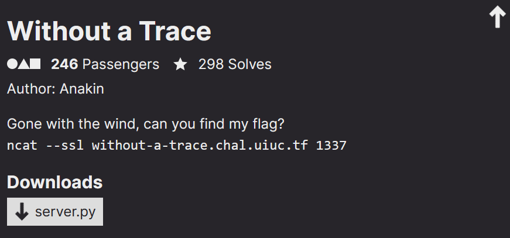
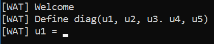

<link rel="stylesheet" href="../writeupcss.css">
<link rel="stylesheet" href="../code.css">

<h2>
{{ site.subtitle }}
</h2>

[Home](https://stainedswan.github.io/UIUCTF-2024)
[OSINT](https://stainedswan.github.io/UIUCTF-2024/OSINT)
[Crypto](https://stainedswan.github.io/UIUCTF-2024/Crypto)
[Miscellaneous](https://stainedswan.github.io/UIUCTF-2024/Miscellaneous)

# Without a Trace Writeup

<div style="text-align:center" markdown="1">
<h2>

Description
</h2>
</div>

<div style="text-align:center"></div>

## Information gained from prompt
- server.py file

### server.py file contents

```python
import numpy as np
from Crypto.Util.number import bytes_to_long
from itertools import permutations
from SECRET import FLAG


def inputs():
    print("[WAT] Define diag(u1, u2, u3. u4, u5)")
    M = [
        [0, 0, 0, 0, 0],
        [0, 0, 0, 0, 0],
        [0, 0, 0, 0, 0],
        [0, 0, 0, 0, 0],
        [0, 0, 0, 0, 0],
    ]
    for i in range(5):
        try:
            M[i][i] = int(input(f"[WAT] u{i + 1} = "))
        except:
            return None
    return M

def handler(signum, frame):
    raise Exception("[WAT] You're trying too hard, try something simpler")

def check(M):
    def sign(sigma):
        l = 0
        for i in range(5):
            for j in range(i + 1, 5):
                if sigma[i] > sigma[j]:
                    l += 1
        return (-1)**l

    res = 0
    for sigma in permutations([0,1,2,3,4]):
        curr = 1
        for i in range(5):
            curr *= M[sigma[i]][i]
        res += sign(sigma) * curr
    return res

def fun(M):
    f = [bytes_to_long(bytes(FLAG[5*i:5*(i+1)], 'utf-8')) for i in range(5)]
    F = [
        [0, 0, 0, 0, 0],
        [0, 0, 0, 0, 0],
        [0, 0, 0, 0, 0],
        [0, 0, 0, 0, 0],
        [0, 0, 0, 0, 0],
    ]
    for i in range(5):
        F[i][i] = f[i]

    try:
        R = np.matmul(F, M)
        return np.trace(R)

    except:
        print("[WAT] You're trying too hard, try something simpler")
        return None

def main():
    print("[WAT] Welcome")
    M = inputs()
    if M is None:
        print("[WAT] You tried something weird...")
        return
    elif check(M) == 0:
        print("[WAT] It's not going to be that easy...")
        return

    res = fun(M)
    if res == None:
        print("[WAT] You tried something weird...")
        return
    print(f"[WAT] Have fun: {res}")

if __name__ == "__main__":
    main()
```
#### Running server.py


## Information Gathering Stage
The first thing we had to do was figure out how the code worked. We realized that the `inputs()` function would be used to create a matrix where only the diagonal elements would be filled based on user input, and that the `handler()` and `check()` functions were used to check the validity of the matrix. Then, We figured out that the `fun()` function would return the trace (sum of the elements on the diagonal) of the product of the inputted matrix and a matrix where the diagonal elements were filled with pieces of the flag. 

## Thinking Stage
We figured out that the way to solve this challenge would be to create 5 valid matrices and then use the trace to set up a system of equations and solve for each piece of the flag. 

To make this easy, we inputted 11111, 12111, 11211, 11121, and 11112. Outputs, respectively:

    2000128101369
    2440285994541
    2426159182680
    2163980646766
    2465934208374

## The Solve
From there, we set up a system of equations using each coefficient we entered and the corresponding traces, solved for the decimal values of the flag, converted those decimals to hex and the hex to ascii, and retrieved the flag.

```txt
The flag for Without a Trace is uiuctf{tr4c1ng_&&_mult5!}
```


Written by @cornguy.

Formatted by @goldenscience