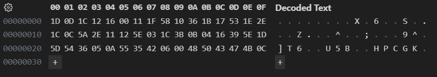

<link rel="stylesheet" href="../writeupcss.css">
<link rel="stylesheet" href="../code.css">

<h2>
{{ site.subtitle }}
</h2>

[Home](https://stainedswan.github.io/UIUCTF-2024)
[OSINT](https://stainedswan.github.io/UIUCTF-2024/OSINT)
[Crypto](https://stainedswan.github.io/UIUCTF-2024/Crypto)
[Miscellaneous](https://stainedswan.github.io/UIUCTF-2024/Miscellaneous)

# X Marked the Spot Writeup

<div style="text-align:center" markdown="1">
<h2>

Description
</h2>
</div>

<div style="text-align:center"></div>

## Information gained from prompt
- public.py file
- ct file (contains the ciphertext)

### public.py file contents

```python
from itertools import cycle

flag = b"uiuctf{????????????????????????????????????????}"
# len(flag) = 48
key  = b"????????"
# len(key) = 8
ct = bytes(x ^ y for x, y in zip(flag, cycle(key)))

with open("ct", "wb") as ct_file:
    ct_file.write(ct)
```

## Information Gathering Stage
The first thing we had to do was figure out how the `zip()` and `cycle()` functions worked. We figured out that the zip function takes two elements and groups their corresponding pairs into tuples. This is also explained in the [Python functions docs](https://docs.python.org/3/library/functions.html#zip). 

Then we move to the cycle function, it iterates over an element until it is exhausted (not to say that it is tired, but that there is nothing more to iterate over), as described in [Python iterator docs](https://docs.python.org/3/library/itertools.html#itertools.cycle). 


## Thinking Stage
With this, we understood that the program was taking the 8 letter key and XOR'ing it against the 48 letter flag in groups of 8 since the key had 8 letters. From there, we took the ciphertext and plugged it into VSCode's hex editor to get the ciphertext's binary. We then grouped it into 6 elements, each of which would be the key XOR'ed with a piece of the plaintext. 



## The Solve
We figured out that the first 7 elements of the ciphertext had to correspond to uiuctf{ and that the last element of the ciphertext had to correspond to }. So, to figure out the key, we need to XOR uiuctf{} with the appropriate elements of the ciphertext to retrieve the key. *From there, we just XOR'ed the key with the ciphertext to get the flag.*

### Manual Key Calculation
```
x ^ a = 1D 0D 1C 12 16 00 11 1F - 7569756374667b6e
x ^ b = 58 10 36 1B 17 53 1E 2E - 30745f6a7535745f
x ^ c = 1C 0C 5A 2E 11 12 5E 03 - 7468335f73743472
x ^ d = 1C 3B 0B 04 16 39 5E 1D - 745f6275745f346c
x ^ e = 5D 54 36 05 0A 55 35 42 - 35305f7468335f33
x ^ f = 06 00 48 50 43 47 4B 0C - 6e6421212121217d

key = 1D 0D 1C 12 16 00 11 0C ^ 75 69 75 63 74 66 7B 7D
    = 68 64 69 71 62 66 6a 71
```

```txt
The flag for X Marked the Spot is uiuctf{n0t_ju5t_th3_st4rt_but_4l50_th3_3nd!!!!!}
```

Written by @cornguy.

Formatted by @goldenscience