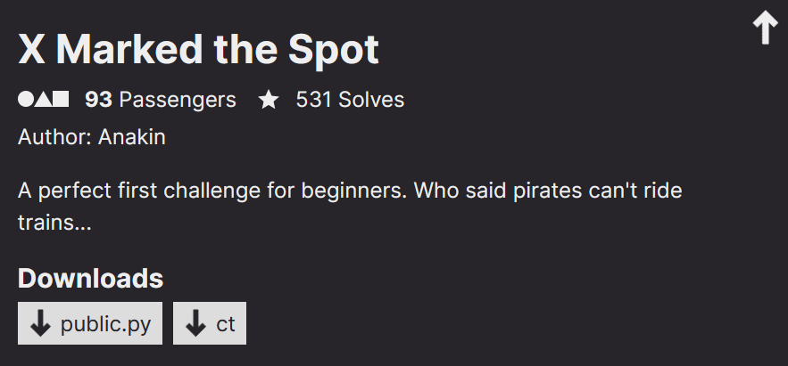

<link rel="stylesheet" href="../writeupcss.css">

<h2>
{{ site.subtitle }}
</h2>

[Home](https://stainedswan.github.io/UIUCTF-2024)
[OSINT](https://stainedswan.github.io/UIUCTF-2024/OSINT)
[Crypto](https://stainedswan.github.io/UIUCTF-2024/Crypto)
[Miscellaneous](https://stainedswan.github.io/UIUCTF-2024/Miscellaneous)

# X Marked the Spot Writeup

<h2>

Description
</h2>

The first thing we had to do was figure out how the zip() and cycle() functions worked. The zip function takes two elements and groups their corresponding pairs into tuples. The cycle function iterates an element over and over. We figured out that the program was taking the 8 letter key and xor’ing it against the 48 letter flag in groups of 8 since the key had 8 letters. From there, we took the ciphertext and plugged it into vscode’s hex editor to get the ciphertext’s binary. We then grouped it into 6 elements, each of which would be the key xor’ed with a piece of the plaintext. We figured out that the first 7 elements of the ciphertext had to correspond to uiuctf{ and that the last element of the ciphertext had to correspond to }, so we xor’ed uiuctf{} with the appropriate elements of the ciphertext to retrieve the key. From there, we just xor’ed the keywith the ciphertext to get the flag.

Written by @cornguy.