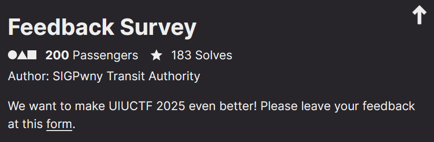
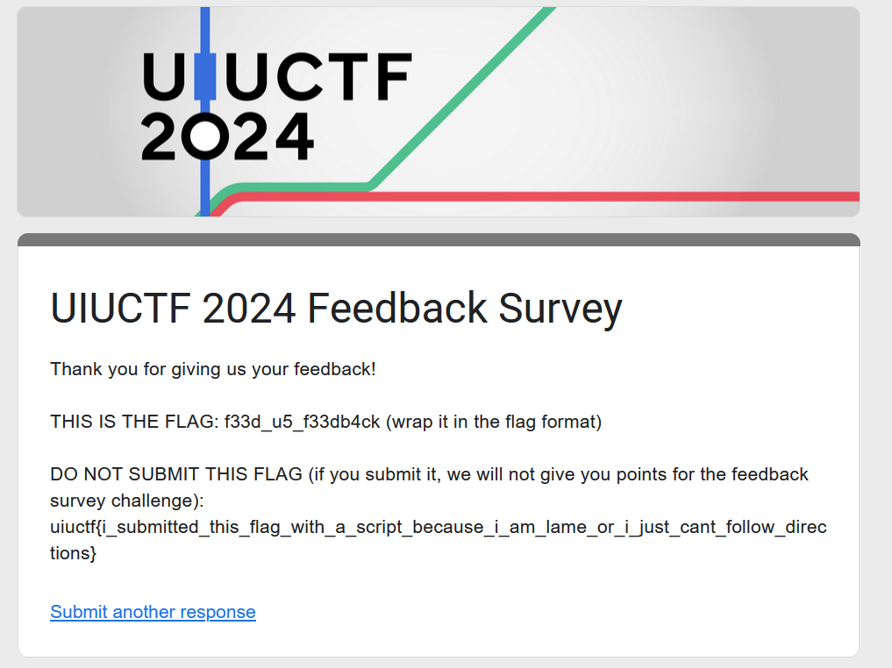

<link rel="stylesheet" href="../writeupcss.css">

<h2>
{{ site.subtitle }}
</h2>

[Home](https://stainedswan.github.io/UIUCTF-2024)
[OSINT](https://stainedswan.github.io/UIUCTF-2024/OSINT)
[Crypto](https://stainedswan.github.io/UIUCTF-2024/Crypto)
[Miscellaneous](https://stainedswan.github.io/UIUCTF-2024/Miscellaneous)

# Feedback Survey Writeup

<div style="text-align:center" markdown="1">
<h2>

Description
</h2>
</div>

<div style="text-align:center"></div>

> Arguably the most difficult challenge mentally to ensure that you are doing the right thing.

Upon generously completing the feedback survey for the organizers, we were taken to a page with two flags. Now, at this point the person who completed the survey was very tired because we had been working on challenges for nearly the whole duration of the competition (although unlike some teams, we're sure, we did not sacrifice (too much) sleep). So, we were already second-guessing ourselves when getting here.



We can tell you that our teammate did start highlighting the fake flag to copy it 😱, but noticed just before copying that something seemed off. Based on the words in the fake flag, we were able to tell that it was wrong and began to search for the real flag.

The search was fast and, thankfully, we found the real flag quickly.

```txt
    The flag for Feedback Survey is uiuctf{f33d_u5_f33db4ck}
```

Written and formatted by @goldenscience