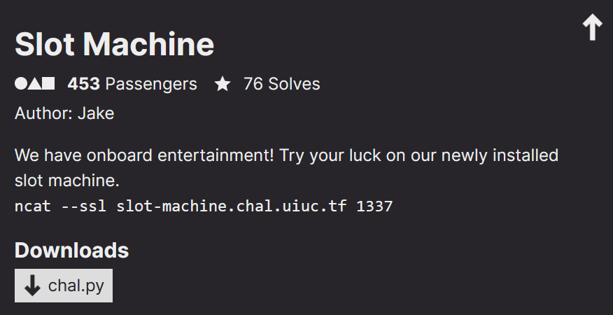
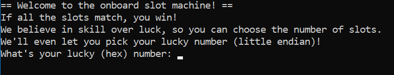

<link rel="stylesheet" href="../writeupcss.css">
<link rel="stylesheet" href="../code.css">


<h2>
{{ site.subtitle }}
</h2>

[Home](https://stainedswan.github.io/UIUCTF-2024)
[OSINT](https://stainedswan.github.io/UIUCTF-2024/OSINT)
[Crypto](https://stainedswan.github.io/UIUCTF-2024/Crypto)
[Miscellaneous](https://stainedswan.github.io/UIUCTF-2024/Miscellaneous)

# Slot Machine Writeup

<div style="text-align:center" markdown="1">
<h2>

Description
</h2>
</div>

<div style="text-align:center"></div>

## Information gained from prompt
- chal.py file

### chal.py file contents
```python
from hashlib import sha256

hex_alpha = "0123456789abcdef"

print("== Welcome to the onboard slot machine! ==")
print("If all the slots match, you win!")
print("We believe in skill over luck, so you can choose the number of slots.")
print("We'll even let you pick your lucky number (little endian)!")

lucky_number = input("What's your lucky (hex) number: ").lower().strip()
lucky_number = lucky_number.rjust(len(lucky_number) + len(lucky_number) % 2, "0")
if not all(c in hex_alpha for c in lucky_number):
    print("Hey! That's not a hex number! -999 luck!")
    exit(1)
hash = sha256(bytes.fromhex(lucky_number)[::-1]).digest()[::-1].hex()

length = min(32, int(input("How lucky are you feeling today? Enter the number of slots: ")))

print("=" * (length * 4 + 1))
print("|", end="")
for c in hash[:length]:
    print(f" {hex_alpha[hex_alpha.index(c) - 1]} |", end="")
print("\n|", end="")
for c in hash[:length]:
    print(f" {c} |", end="")
print("\n|", end="")
for c in hash[:length]:
    print(f" {hex_alpha[hex_alpha.index(c) - 15]} |", end="")
print("\n" + "=" * (length * 4 + 1))

if len(set(hash[:length])) == 1:
    print("Congratulations! You've won:")
    flag = open("flag.txt").read()
    print(flag[:min(len(flag), length)])
else:
    print("Better luck next time!")
```
### Running chal.py



## Information Gathering Stage
Reading through the code, one realizes that to extract the flag we must find a hash that starts with up to 32 of the same hex digit. As with all hash functions, SHA-256 hash input cannot be extracted from the output alone. 

The first option is to brute force hash inputs until we find an output with enough of the same beginning digit. However, given the number of similar leading digit required and the computational power of a home laptop, finding a hash input in a reasonable timeframe would be infeasible, so we had to find a `precomputed hash input`. The largest collection of SHA-256 hashes is the Bitcoin blockchain. More importantly, the hashes in the block chain all start with a certain number of zeros, which is the exact pattern required to "win" the slot machine and extract the hash.


## Thinking Stage
The next step is to find a block in the blockchain with a large number of leading zeros. A little bit of searching leads to [this block](https://blockchair.com/bitcoin/block/756951). Thus we use the bitcoin hashing algorithm to find the hash input that get the hash we require. In this case it's

    0000000000000000000000005d6f06154c8685146aa7bc3dc9843876c9cefd0f

Using the [blockchain academy]((https://blockchain-academy.hs-mittweida.de/courses/blockchain-introduction-technical-beginner-to-intermediate/lessons/lesson-13-bitcoin-block-hash-verification/topic/how-to-calculate-and-verify-a-hash-of-a-block/)) website, we can manually compute the hash input using the following information:

- the hash of the previous block
- the version number of the block
- the Merkle root
- the time stamp the block was added to the blockchain
- the difficulty of the block (known as bits) and
- the Nonce

    Prev Hash: 000000000000000000050da0da9451c2e1306db4ddb5acc965fc1016678d9154
    Version: 20400000
    Merkle Root: 62c46f1efadf6e39b7463e5362bb552cba98f74a80a58378ff5194c7b058005a
    Timestamp: 633B8C2D
    Bits: 1708F9AE
    Nonces: C1230F8C

    Concated String: 0000402054918d671610fc65c9acb5ddb46d30e1c25194daa00d050000000000000000005a0058b0c79451ff7883a5804af798ba2c55bb62533e46b7396edffa1e6fc4622D8C3B63AEF908178C0F23C1

    First Hash: f5b209498bfad650eb000b1917fc119b601e799c18c00b6e562e71300ed1cc93

    Second Hash: 0ffdcec9763884c93dbca76a1485864c15066f5d000000000000000000000000

Make sure all the numbers are in hex and little endian before we concatenate all the strings together. The bitcoin protocol uses double hashing, so the hash is computed of that concatenated string, before a second hash of the first hash is computed. 

```python
def littleEndian(string):
    splited = [str(string)[i:i + 2] for i in range(0, len(str(string)), 2)]
    splited.reverse()
    return "".join(splited)
```

Ensure the string is interpreted as a hex number and not an ascii string to get the right hash output. The second hash should match with the hash we found in the blockchain and start with 24 zeros. Since we need the hash input, we take the first hash and use that.


## The Solve
The last bit of complexity, is that the input string to the slot machine is reversed so we simply reverse the input string we just found and use that as the input to the slot machine. We ask it for 24 slots and since the output hash starts with 24 zeros, we will win and be rewarded with the 24 character flag. 

```txt
The flag for Slot Machine is uiuctf{keep_going!_3cyd}
```

Written by @patrickmushroom

Formatted by @goldenscience