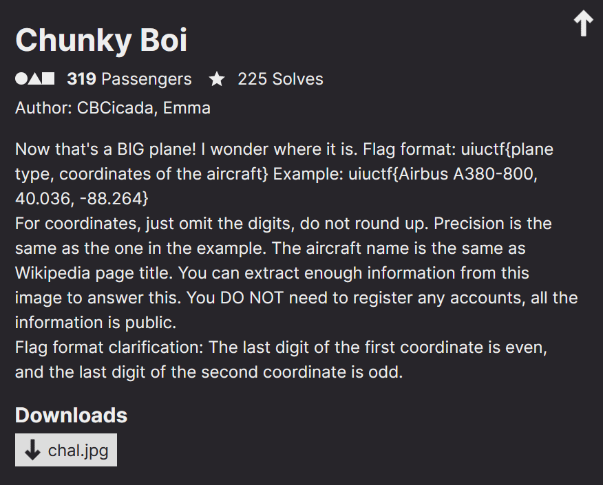
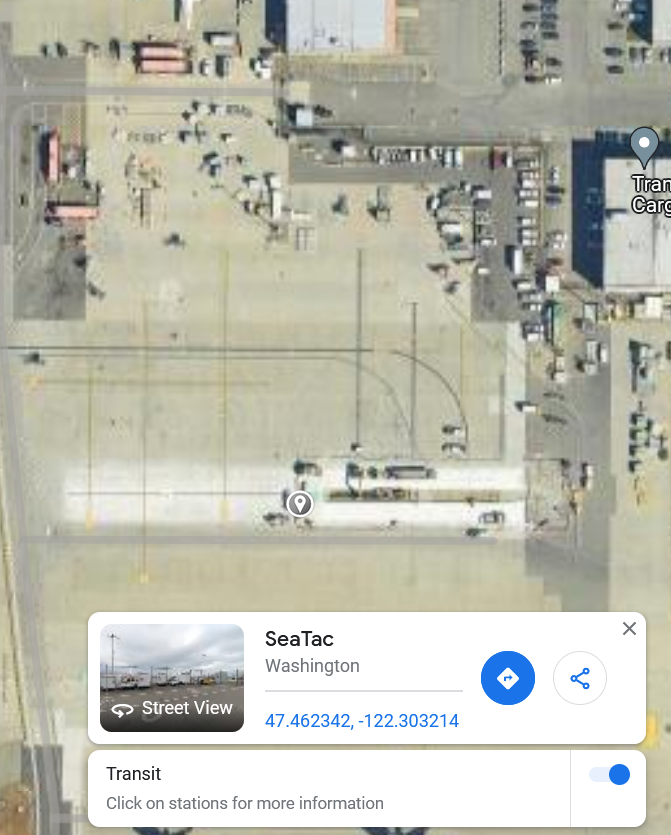

<link rel="stylesheet" href="../writeupcss.css">


<h2>
{{ site.subtitle }}
</h2>

[Home](https://stainedswan.github.io/UIUCTF-2024)
[OSINT](https://stainedswan.github.io/UIUCTF-2024/OSINT)
[Crypto](https://stainedswan.github.io/UIUCTF-2024/Crypto)
[Miscellaneous](https://stainedswan.github.io/UIUCTF-2024/Miscellaneous)

# Chunky Boi Writeup

---

<div style="text-align:center" markdown="1">
<h2>

Description
</h2>
</div>

<div style="text-align:center"></div>

## Information gained from prompt
- chal.jpg

### chal.jpg


## Information Gathering Stage
We need the plane and the coordinates. Google Lens gives us that it is the `Boeing C-17 Globemaster III` right off the bat, so off to a good start.

Next we need to know where it is, and it looks like an airport since we have three planes visible and some sort of runway and a part of the terminal. Two of the planes belong to Alaska Airlines, so we need to find maybe it has a main hub. [According to Wikipedia](https://en.wikipedia.org/wiki/Alaska_Airlines), Alaska Airlines "primary hub is Seattle-Tacoma International Airport."


Now we have the plane and the airport, but how do we figure out the exact coordinates? We need a map.

We find the following [airport diagram](https://www.aopa.org/ustprocs/20240613/NW-1/sea_airport_diagram.pdf) below on the Aircraft Owners and Pilots Association website.


The big plane that we are looking for is not for commercial travel, so it would probably not be near the terminal, so according to the map, we need to be looking in the Northeast area of the map.

## Thinking Stage
Here is how the Northeast area of this diagram looks on the satellite map:


We see that planes are in the open only near the very North edge, so we zoom in. We also take note of runway signs for E and B as well as the sign for directions to runways D and C.


## The Solve
We notice that these lines must be those signs. So, we try to orient ourselves to better understand where the plane is using that information. After doing that, it was easy to tell that the huge plane would be in the really big parking space.



Clicking on that area gives us the coordinates `47.462, -122.303` (as requested in the prompt to round to just omit the digits and not round) for the flag. That gives us the last piece and we have completed this challenge!

```text
The flag for Chunky Boi is uiuctf{Boeing C-17 Globemaster III, 47.462, -122.303}
```

Written and formatted by @goldenscience