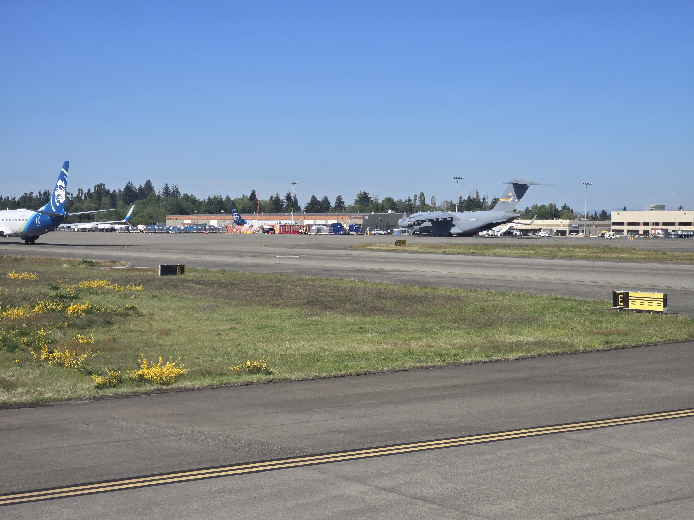
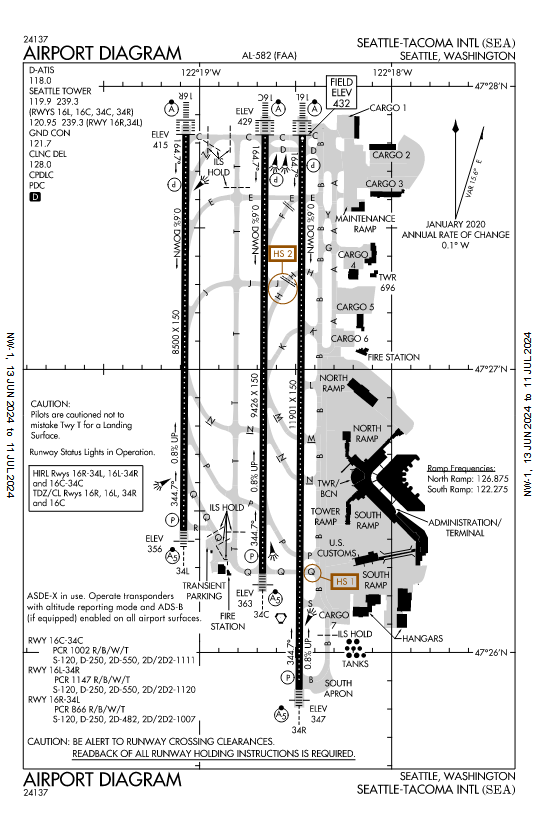

<link rel="stylesheet" href="../writeupcss.css">


<h2>
{{ site.subtitle }}
</h2>

[Home](https://stainedswan.github.io/UIUCTF-2024)
[OSINT](https://stainedswan.github.io/UIUCTF-2024/OSINT)
[Crypto](https://stainedswan.github.io/UIUCTF-2024/Crypto)
[Miscellaneous](https://stainedswan.github.io/UIUCTF-2024/Miscellaneous)

# Geoguesser Suite Writeup

<br/>

# [Challenge 1: Night](#challenge-1-night)

<div style="text-align:center" markdown="1">
<h2>

Description
</h2>
</div>

<div style="text-align:center"></div>

## Information gained from prompt
- chal.jpg image file

### chal.jpg image


## Information Gathering Stage
The first thing we did, as any good OSINT challenge contender would do, is run our image through Google Lens.

By selecting the skyline, we are able to quickly find out that we should be looking in `Boston, Massachusetts, USA`.


## Thinking Stage
Next, we need to take a closer look at the image and see what we can find. We notice the `skyscrapers`, of course, as well as the fact that there is a `small bridge` ahead and the `yellow sign` on the right which indicates on incoming merging lane. It is a three lane (x2) two-way road with a `barrier` in between. There looks to be some sort of `railroad tracks` to the left of the photo.

Further selection shows us that the domed building in the background is this building:
<div class="column" style="text-align:center"></div>

With this knowledge, we begin scouring Google Maps for the location, marking the location of the domed building for reference and selecting transit lines to be shown.
<div class="column" style="text-align:center"></div>


## The Solve
We find a heavy rail route and follow along. There is also the two-way three lane road here! We follow along the rail for a while, but then it separates from the road. Since we are more sure about the road, we zoom out a bit and try to find a wide road that also goes along a rail route. 


Then we see the big interstate road, that also runs along a heavy rail and would have a view of the skyskraper... hmmm... Zooming in! This looks really promising, since we see lots of bridges and merging areas. We start from where the interstate and the highway merge and go towards the skyskraper, checking where any road merges in. Street view!

Soon enough, we get to here.


This is it!! Down to the lamppost, this is the place. To take this photo, the person must have been on the bridge behind us. So, the street name is Arlington Street and it's in Boston!


```txt
The flag for Night is uiuctf{Arlington Street, Boston}
```

# [Challenge 2: Chunky Boi](#challenge-2-chunky-boi)

<div style="text-align:center" markdown="1">
<h2>

Description
</h2>
</div>

<div style="text-align:center"></div>

## Information gained from prompt
- chal.jpg

### chal.jpg



## Information Gathering Stage
We need the plane and the coordinates. Google Lens gives us that it is the `Boeing C-17 Globemaster III` right off the bat, so off to a good start.


Next we need to know where it is, and it looks like an airport since we have three planes visible and some sort of runway and a part of the terminal. Two of the planes belong to Alaska Airlines, so we need to find maybe it has a main hub. [According to Wikipedia](https://en.wikipedia.org/wiki/Alaska_Airlines), Alaska Airlines is headquarterd near Seattle-Tacoma International Airport.

Now we have the plane and the airport, but how do we figure out the exact coordinates? We need a map.

We find the following [airport diagram](https://www.aopa.org/ustprocs/20240613/NW-1/sea_airport_diagram.pdf) below on the Aircraft Owners and Pilots Association website.

<div class="column" style="text-align:center"></div>

The big plane that we are looking for is not for commercial travel, so it would probably not be near the terminal, so according to the map, we need to be looking in the Northeast area of the map.

## Thinking Stage
Here is how the Northeast area of this diagram looks on the satellite map:
<div class="column" style="text-align:center"></div>

We see that planes are in the open only near the very North edge, so we zoom in. We also take note of runway signs for E and B as well as the sign for directions to runways D and C.

<div class="column" style="text-align:center"></div>

## The Solve
We notice that these lines must be those signs. So, we try to orient ourselves to better understand where the plane is using that information. After doing that, it was easy to tell that the huge plane would be in the really big parking space.

<div class="column" style="text-align:center"></div>

Clicking on that area gives us the coordinates `47.462, -122.303` (as requested in the prompt to round to just omit the digits and not round) for the flag. That gives us the last piece and we have completed this challenge!


```txt
The flag for Chunky Boi is uiuctf{Boeing C-17 Globemaster III, 47.462, -122.303}
```


# [Challenge 3: New Dallas](#challenge-3-new-dallas)


Written and formatted by @goldenscience