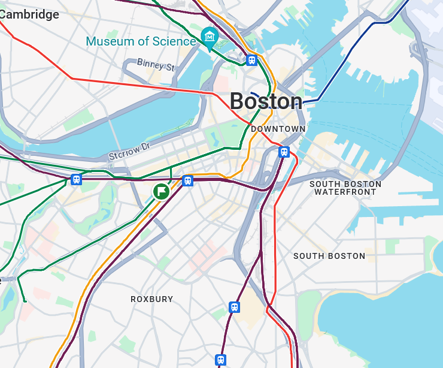

<link rel="stylesheet" href="../writeupcss.css">


<h2>
{{ site.subtitle }}
</h2>

[Home](https://stainedswan.github.io/UIUCTF-2024)
[OSINT](https://stainedswan.github.io/UIUCTF-2024/OSINT)
[Crypto](https://stainedswan.github.io/UIUCTF-2024/Crypto)
[Miscellaneous](https://stainedswan.github.io/UIUCTF-2024/Miscellaneous)

# Night Writeup

---

<div style="text-align:center" markdown="1">
<h2>

Description
</h2>
</div>

<div style="text-align:center"></div>

## Information gained from prompt
- chal.jpg image file

### chal.jpg image


## Information Gathering Stage
The first thing we did, as any good OSINT challenge contender would do, is run our image through Google Lens.

By selecting the skyline, we are able to quickly find out that we should be looking in `Boston, Massachusetts, USA`.


## Thinking Stage
Next, we need to take a closer look at the image and see what we can find. We notice the `skyscrapers`, of course, as well as the fact that there is a `small bridge` ahead and the `yellow sign` on the right which indicates on incoming merging lane. It is a three lane (x2) two-way road with a `barrier` in between. There looks to be some sort of `railroad tracks` to the left of the photo.

Further selection shows us that the domed building in the background is this building:


With this knowledge, we begin scouring Google Maps for the location, marking the location of the domed building for reference and selecting transit lines to be shown.



## The Solve
We find a heavy rail route and follow along. There is also the two-way three lane road here! We follow along the rail for a while, but then it separates from the road. Since we are more sure about the road, we zoom out a bit and try to find a wide road that also goes along a rail route. 


Then we see the big interstate road, that also runs along a heavy rail and would have a view of the skyskraper... hmmm... Zooming in! This looks really promising, since we see lots of bridges and merging areas. We start from where the interstate and the highway merge and go towards the skyskraper, checking where any road merges in. Street view!

Soon enough, we get to here.


This is it!! Down to the lamppost, this is the place. To take this photo, the person must have been on the bridge behind us. So, the street name is Arlington Street and it's in Boston!


```txt
The flag for Night is uiuctf{Arlington Street, Boston}
```

Written and formatted by @goldenscience