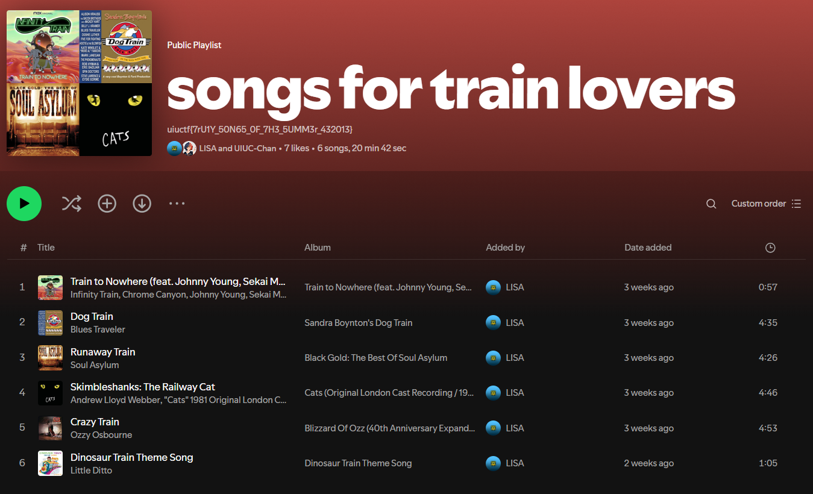

<link rel="stylesheet" href="../writeupcss.css">

<h1> UIUC-Chan Suite Writeup </h1>

---

We read through each of the prompts in the suite to get an idea what we were getting into before beginning. There isn't much to go off of, but seems like it will be fun, so let's get started.

> Disclaimer: All screenshots taken after UIUCTF ended

# Challenge 1: Hip With the Youth

<h2>

**Challenge 1 Description**
</h2>

## Information gained from prompt
- `Long Island Subway Authority` or `LISA` are names to look out for
- Something on `Instagram`

Okay, so we need to use Instagram and "find a way" to somewhere else with it?

## Information Gathering Stage

Searching for `LISA` for accounts on Instagram didn't give us much.

However, `long island subway authority` got us to what we suspected was the correct account.

Both posts themselves are not helpful, the account was not tagged in any external posts, and the followers seemed to just be other participants of the CTF event.

Then, we noticed the [threads link](https://www.threads.net/@longislandsubwayauthority). 

> The member working on this challenge at the time did not have the threads app on her phone, and did not want to install it or create an account for it. Because of this, we skipped to Challenge 2 and came back to this challenge later.

  
After we figured out we could go to threads on the Web, we did and arrived at the relevant account (with the same LinkedIn page link found in Challenge 2).

## Thinking Stage
The following image shows the posts that are visible for this account. We can see that one mentions the flag, but are not sure what to do since we aren't logged in.

Again, we thought that we had to log in to see more, so we took a pause on this challenge and came back a few minutes later. 
  

> The reason we thought we needed an account to view more was because we were not familiar with the threads interface and it looked like you had to log in to see more content.

## The Solve
Coming back to this challenge again, we became more determined and actually clicked on the posts... of course. By selecting either of the last two posts shown in the image above, we see the flag immediately.

	The flag for Challenge 1 is uiuctf{7W1773r_K!113r_321879}

---

# Challenge 2: An Unlikely Partnership

<h2>
Challenge 2 Description
</h2>

## Information gained from prompt
- LISA has a `business partnership`

> We start this challenge prior to completing `Hip With the Youth` (Challenge 1 of this suite), so we do not have the LinkedIn link found at the completion of that part yet.

## Information Gathering Stage
We decide to go to our trusty search engine and see what it'll chug out for us... see what I did there? :) 🚆

Our initial search didn't give us much, but with some keyword addition we get a [LinkedIn page](https://www.linkedin.com/in/long-island-subway-authority/)!

<b>Search #1: "Long Island Subway Authority"</b>

 

<b>Search #2: "Long Island Subway Authority +LISA"</b>

 

The following information about the account makes us even more certain we have the right account.

 

## Thinking Stage

The following elements are included in a typical LinkedIn page:
- `About`
- `Activity`
- `Experience`
- `Skills`
- `Interests`

We can immediately cross off ~~`About`~~, ~~`Experience`~~, and ~~`Interests`~~ just from looking at them because those are simply text fields without any links, so we have **`Activity`** and **`Skills`** left. 

Three of the four items on the `Activity` page are simply links to LinkedIn games Pinpoint and Crossclimb, so we ignore those. The last post left is just a text post, no flags in sight.

The only section left that may have the flag is therefore the `Skills` section.

## The Solve
Last, but not least, we check out the Skills page. 

 

> Ooh, an endorsement... I wonder who that could be?

 

Gotchya! <mark>UIUC Chan</mark> has endorsed the Transportation skill of LISA!

The flag is now pinpointed to be in the About section of UIUC Chan's profile.

 

	The flag for Challenge 2 is uiuctf{0M1g0D_UIUCCH4N_15_MY_F4V0r173_129301}

-------

# Challenge 3: The Weakest Link

<h2>
Challenge 3 Description
</h2>

## Information gained from prompt
- What we need will be on `Spotify`
- Look out for a feature that can be set to private or not private (public?)
- It includes something that is a `collaboration`

> From Challenge 2 in this suite, we know the name of the "secret business partner" is `UIUC-Chan`

## Information Gathering Stage

UIUC Chan's LinkedIn profile found in Challenge 2 has the link to her Spotify profile, much to her embarrassment!

 

Spotify link: [open.spotify.com/user/31d2lcivqdieyl4qzx25vfmp6jt4?si=b769b2466f7e4101](https://open.spotify.com/user/31d2lcivqdieyl4qzx25vfmp6jt4?si=b769b2466f7e4101)

At first glance, it doesn't look like much to us. It only has one public playlist.

We begin playing the songs in from the `songs to hail to the orange and hail to the blue to` playlist, perhaps the flag is hidden in a song? That would be cool...

The name of the playlist threw us off a bit. Were we supposed to know something about the Illini fight song??

 

Next, we check the people who created the songs in the playlist. We find that both belong to verified accounts with a large number of monthly listeners. Due to this fact, they seem legit (i.e. not made for this challenge), so we try another direction.

 

 

It was at this point that we noticed the UIUC-Chan account had gained several more followers since we started looking, having only 4 followers the first time we viewed the account. This seemed interesting, so we also followed the account, hoping for something.

## Thinking Stage

After following the account, it did not seem like anything changed, so we did a quick Google search. The first hit gave us an explanation.

<b>Search term: "what information can you gain from following a spotify account"</b>

 

Aha! `You will see what your friend is playing as long as his listening habits are public and you have the Friend Feed open.` We now recall the prompt: `Spotify collaboration ... neither ... keep it private.` This line combined with this new knowledge makes it clear to us that we are on the right track.

We find the `Friend Activity` button (seems they renamed the feature since 2017) at the top right of the screen. Clicking on it opens a new panel to the right with the activity, just as we were told by @detective889 in the post! Shown below is this button as well as the panel that opens.

|  |  |
| ----------------------------------------- | ----------------------------------------- |

## The Solve

Going in order of what is shown to us in the Friend Activity panel - from top to bottom and left to right - we have:

| item | element |
| ----------------------------------------- | ----------------------------------------- |
| profile name | `UIUC-Chan` |
|name of current song this user is playing|`Skimbleshanks: The Railway Cat` |
| artist name | `Andrew Lloyd Webber` |
| playlist name | `songs for train lovers` |

> we play the currently playing song for good measure, still hoping the flag would be given to us in song form...

 

From here, we clicked on each item just in case, but then remembered the prompt again, `collaboration`, this must mean a combined playlist! Selecting the playlist name leads us to the playlist and low and behold, we have captured the flag!

It is located in the description section of the playlist information. We know for certain it is related to our challenge because now we see LISA is the one who added the songs to the playlist!

	The flag for this challenge is `uiuctf{7rU1Y_50N65_0F_7H3_5UMM3r_432013}

Hooray! This marks the completion of the UIUC-Chan OSINT suite. That was super fun.

# Post Completion Thoughts

- During the creation of this writeup, we realized that if we had been reading more carefully that this suite would have been more straightforward and that there were some very clever hints hidden about.
- We commend the challenge writer of this suite, Emma, for writing such great hidden-in-plain-sight hints.
